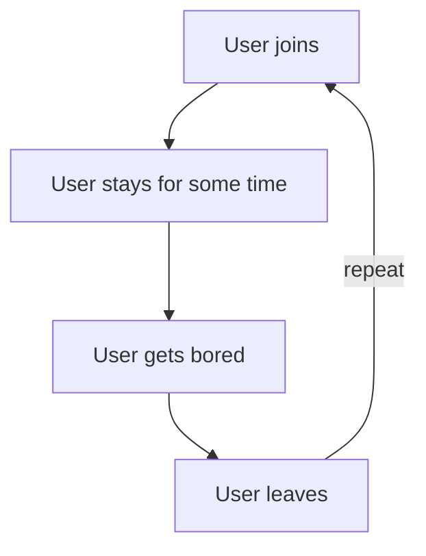
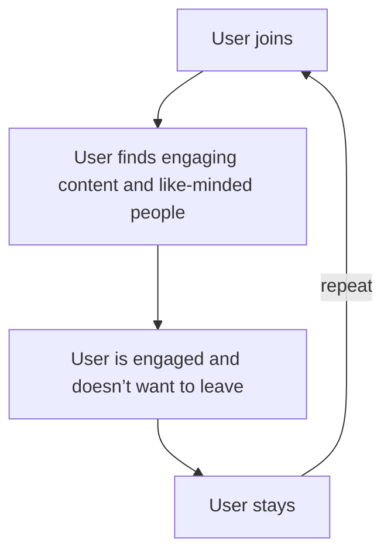

Written in [Obsidian](https://obsidian.md/) using [Mermaid](https://mermaid.js.org/) diagrams

---

## The wrong cycle of user retention

---
## The right cycle of user retention

---
## What we need to get to the right cycle

### 1. Make users join
- #### Advertise
	- YouTube (probably the best one)
	- Other Discord servers
	- Any online place
	- ##### How
		- Make the ad stand out
		- Give a good description
		- Make the ad entertaining if possible

### 2. Level up user retention
- #### Make it enjoyable to be in the server
	- #### What we need for that
		- A clear purpose (of the server)
		- Like-minded people (creates a feedback loop)
		- Engaging server features
			- Unique and fun bots
			- Regular engaging content such as
				- Events
				- Giveaways
				- Competitions
		- Good moderation
		- Welcoming and engaging atmosphere

---
## Steps

### 1. Add a small amount of users and good moderators
### 2. Ask the small team to give us good improvements
### 3. Improve our server
### 4. Get more people
### 5. Actively listen for criticism
### 6. Repeat from step 4

---
## And how exactly do we start?

Follow steps 1 - 3.

All we need is dedication. 

I'll try my best. I hope you do too.

---
